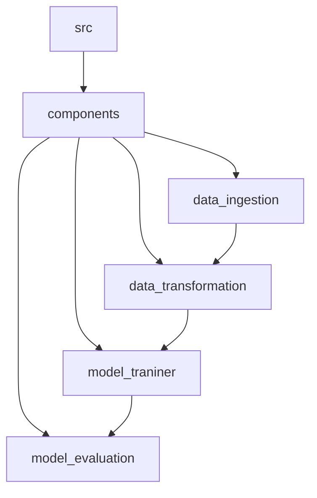

``` 
install mermaid extension in vscode for flowcharts
```
```
setup.py ke andar jo code h uski help se m local packages ko import kr paa rha hu
```


### yaha m step by step wo process likhunga jo maine kiye to make the project (*only applicable to ML projects*)
---
1. ek template.py naam ki file banai jisme maine poore project ka structure banaya tha
2. phir maine requirements_dev.txt me libraries daali
3. phir maine init_setup.sh file me mere virtual environment ko set krne ke liye code likha 
4. phir maine experiments.ipynb me data ka EDA kiya aur encoding kiya aur categorical and numerical columns ko alag kr liya
5. Fir data preprocessing krne ke liye Pipeline banai for both categorical and numerical columns
6. fir ColumnTransformer me dono pipeline bhej di
7. phir maine data split kr dia
8. fit_transform the train data and store that transformed data in x_train and x_test respectively
9. transform the test data
10. model building -> ya pe maine ek models ki dictionary banai, taaki indivisually run na krna pade
11. aur kuch empty list bana li for storing results
12. ek function bana liya jo loss, r2 value nikal ke dega
13. fir data ke saath saare models ko fit kr diya, aur predict bhi chala dia aur results lists me store kr diye
## we are done with experiments, ab code ko modularize karenge and proper pipeline banaenge

14. humne sabse phle apna khudka custom excepttion banane se chalu kiya kyoki hume 
exceptions ki jayada se jayada info chahiye, its a good practice for debugging.

15. phir logging ke upar kaam kiya jo kya karega ki wo ek logs naam ka folder banaega and jab bhi hum poore project me logging karenege toh hamare saare logs ek hi jagah rahenge aur hamare saare logs store honge in a specific format and wo format hoga 
> current_time | line_number | username | log_level | log_message\
>for example -> \
>[2024-09-05 16:57:25,468] 21 root - INFO - This is an info message\
>(**root** is default)




the output of each component will be stored in **Artifacts** and later send to next component
