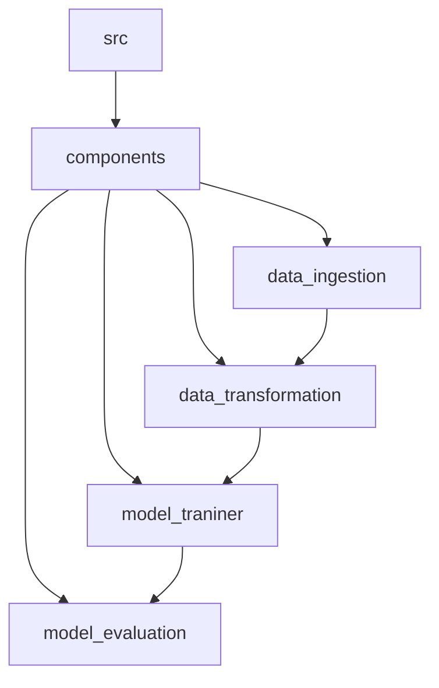

``` 
install mermaid extension in vscode for flowcharts
```
```
setup.py ke andar jo code h uski help se m local packages ko import kr paa rha hu
```


### yaha m step by step wo process likhunga jo maine kiye to make the project (*only applicable to ML projects*)
---
1. ek template.py naam ki file banai jisme maine poore project ka structure banaya tha
2. phir maine requirements_dev.txt me libraries daali
3. phir maine init_setup.sh file me mere virtual environment ko set krne ke liye code likha 
4. phir maine experiments.ipynb me data ka EDA kiya aur encoding kiya aur categorical and numerical columns ko alag kr liya
5. Fir data preprocessing krne ke liye Pipeline banai for both categorical and numerical columns
6. fir ColumnTransformer me dono pipeline bhej di
7. phir maine data split kr dia
8. fit_transform the train data and store that transformed data in x_train and x_test respectively
9. transform the test data
10. model building -> ya pe maine ek models ki dictionary banai, taaki indivisually run na krna pade
11. aur kuch empty list bana li for storing results
12. ek function bana liya jo loss, r2 value nikal ke dega
13. fir data ke saath saare models ko fit kr diya, aur predict bhi chala dia aur results lists me store kr diye
## we are done with experiments, ab code ko modularize karenge and proper pipeline banaenge

14. humne sabse phle apna khudka custom excepttion banane se chalu kiya kyoki hume 
exceptions ki jayada se jayada info chahiye, its a good practice for debugging.

15. phir logging ke upar kaam kiya jo kya karega ki wo ek logs naam ka folder banaega and jab bhi hum poore project me logging karenege toh hamare saare logs ek hi jagah rahenge aur hamare saare logs store honge in a specific format and wo format hoga 
> current_time | line_number | username | log_level | log_message\
>for example -> \
>[2024-09-05 16:57:25,468] 21 root - INFO - This is an info message\
>(**root** is default)




<BR>

the output of each component will be stored in **Artifacts** and later send to next component

## coming to components

> 16. **data_ingestion** me phle configuation wala part banaya jaha pe m data_ingestion ke regarding jo bhi variables honge, unko rakhunga(jaise csv files), you can also make a seperate file for this work
> - toh data_ingestion ki starting me maine phle data read kara aur us data ko "arifacts" naam ki dir me csv format me save kr liya and 
> -  similarly humne train.csv and test.csv ko bhi load kr liya in "artifacts" folder
> - phir humne train and test data ka path return kara diya 

<br>
<br>


<div style="padding : 5px;margin-bottom: 2rem ;border:2px solid rgb(167, 153, 240); border-radius :0.5rem">
<span style="margin-bottom:1rem;border-bottom: 3px solid rgb(167, 153, 240); border-radius :0.1rem">Note</span>
<br>
<br>
The <b>preprocessor.pkl</b> file stores a serialized version of the <b>preprocessor</b> object, which is an instance of the <b>ColumnTransformer</b> class from scikit-learn.

When you load the <b>preprocessor.pkl</b> file in the future, you will get the preprocessor object back. This object can be used to transform new data in the same way as the original training data. It applies the same data transformations, such as imputation, scaling, and encoding, to the new data. This ensures that the new data is processed in the same way as the training data, maintaining consistency in the feature engineering process.
</div>

<br>
<br>

> 17. **data_transformation** me humne pehle configuration wale part me ek path(variable) declare kr diya jaha hamari preprocessor.pkl file store hogi.
> - phir humne ek method banaya (get_data_transform) jisme humne poori pipeline banai regarding data transformation aur us pipeline ke object ko preprocessor.pkl me store kr diya.
> - phir ek aur method banaya(initiate data transformation) jisme humne phle data read karaya and split kara in **input_features** and **target** and phir us train input_features ko fit_transform and test ko transform kiya 
> - phir input_feature and target variable ko concatenate kiya for train and test respectively and return kr dia data ko

<br>
<br>


> 18. **model_trainer** me humne phle kuch model select kiye and unko ek dictionary me store kiya and data ko bhi split kiya in dependent and independent variables
> - utils.py ke evaluate_model method se model ko fit kara ke r2_score return kara liya
> - aur phir model save kr liya in artifacts folder by giving path and object to save_model method(from utils.py)

<br>
<br>

## coming to pipeline

> 19. **training_pipeline** me humne saare components ko ek pipeline me connect kiya
> - pehle saare components ko import kiya aur unka sabka object banaya
> - aur phir un sabko call kiya in a proper sequence

<br>
<br>

> 20. **app.py** me humne phle user se frontend se input le liya aur usko **predicting_pipeline** me bhej diya, waha pe wo input ek dataframe me convert hua aur phir model ka **predict** method chala ke prediction return kr diya
> - aur phir us prediction ko user ko return kiya using jinja template of flask

<br>
<br>

## Now its time to apply different tools in our model

 ## *1) MLFLOW*  
 >**[Quick Start](https://mlflow.org/docs/latest/getting-started/intro-quickstart/index.html)** <- click here for quick start

mlflow helps in logging the data/metadata regarding model. When you run your pipeline again and again with some changes in the presennce of mlflow then you can log lot of things such as metrics, parameters, artifacts, etc. and you can see the changes in the mlflow ui.
```bash
mlflow ui
```
by running this above command, you can see the mlflow ui in your browser and you can see the changes in the model and the data.


